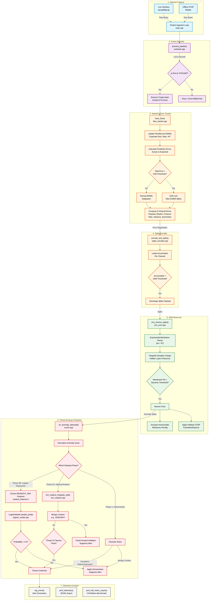

```mermaid
flowchart TD
    classDef capture fill:#e1f5fe,stroke:#0288d1,stroke-width:2px,color:#000
    classDef extract fill:#f3e5f5,stroke:#8e24aa,stroke-width:2px,color:#000
    classDef math fill:#fff3e0,stroke:#e65100,stroke-width:2px,color:#000
    classDef snn fill:#e8f5e9,stroke:#388e3c,stroke-width:2px,color:#000
    classDef scorer fill:#ffebee,stroke:#d32f2f,stroke-width:2px,color:#000
    classDef output fill:#f5f5f5,stroke:#616161,stroke-width:2px,color:#000

    subgraph Capture Layer [1. Network Capture]
        A1["Live Interface<br/>npcap/libpcap"] -->|Raw Bytes| A3
        A2["Offline PCAP<br/>Replay"] -->|Raw Bytes| A3
        A3["Packet Ingestion Loop<br/>main.cpp"]
    end
    class A1,A2,A3 capture

    A3 --> B1
    subgraph Decoder Layer [2. Frame Decoder]
        B1["process_packet()<br/>extractor.cpp"]
        B1 -->|L2/L3 Decode| B2{"Is IPv4 & TCP/UDP?"}
        B2 -- No --> B3["Drop / Count Malformed"]
        B2 -- Yes --> B4["Extract 5-Tuple Hash<br/>Src/Dst IP & Ports"]
    end
    class B1,B2,B3,B4 extract

    B4 --> C1
    subgraph Predictive Tracker [3. Statistical Flow Tracker]
        C1["track_flow()<br/>flow_tracker.cpp"] --> C2["Update FlowRecord EWMA<br/>Expected Size, Rate, IAT"]
        C2 --> C3["Calculate Prediction Errors<br/>Actual vs Expected"]
        C3 --> C4{"Total Error &gt;<br/>Drift Threshold?"}
        C4 -- Yes --> C5["Drift Lock<br/>Slow EWMA Alpha"]
        C4 -- No --> C6["Normal EWMA<br/>Adaptation"]
        C5 --> C7
        C6 --> C7
        C7["Compute 6 Channel Errors<br/>Payload, Rhythm, Protocol,<br/>Rate, Variance, Asymmetry"]
    end
    class C1,C2,C3,C4,C5,C6,C7 math

    C7 -->|Error Magnitudes| D1
    subgraph Encoder Layer [4. Spike Encoder]
        D1["encode_and_spike()<br/>spike_encoder.cpp"] --> D2["Leaky Accumulator<br/>Per Channel"]
        D2 --> D3{"Accumulator &gt;<br/>1500 Threshold?"}
        D3 -- Yes --> D4["Discharge Spike Payload"]
    end
    class D1,D2,D3,D4 math

    D4 -->|Spike| E1
    subgraph Neuromorphic Core [5. SNN Reservoir]
        E1["snn_receive_spike()<br/>snn_core.cpp"] --> E2["Exponential Membrane Decay<br/>tau = 0.5"]
        E2 --> E3["Integrate Synaptic Charge<br/>Hidden Layer 8 Neurons"]
        E3 --> E4{"Membrane Pot &gt;<br/>Dynamic Threshold?"}
        E4 -- Yes --> E5["Neuron Fires"]
        E5 --> E6["Apply Hebbian STDP<br/>Potentiate/Depress"]
        E5 --> E7["Increase Homeostatic<br/>Refractory Penalty"]
    end
    class E1,E2,E3,E4,E5,E6,E7 snn

    E5 -->|Anomaly Spike| F1
    subgraph Scorer Layer [6. Threat Scoring & Readout]
        F1["on_anomaly_detected()<br/>scorer.cpp"] --> F2["Normalize Anomaly Score"]
        F2 --> F3{"Which Readout Phase?"}
        F3 -- "Phase 1: Deterministic" --> F4["Heuristic Rules"]
        F4 -- "Benign Context" --> F5["Apply Homeostasis<br/>Suppress Alert"]
        F4 -- "Persistent Spikes/Volumetric" --> F6["Threat Confirmed"]
        F3 -- "Phase 2A: Spiking Readout" --> F7["snn_readout_integrate_spike<br/>snn_readout.cpp"]
        F7 --> F8["Benign Context<br/>e.g., DNS/SSH?"]
        F8 -- Yes --> F9["Feed-Forward Inhibition<br/>Suppress Alert"]
        F8 -- No --> F10{"Threat LIF Neuron<br/>Fired?"}
        F10 -- Yes --> F6
        F3 -- "Phase 2B: Logistic Regression" --> F11["Extract READOUT_DIM Features<br/>readout_features.h"]
        F11 --> F12["LogisticModel::predict_proba<br/>logistic_model.cpp"]
        F12 --> F13{"Probability &gt; 0.5?"}
        F13 -- No --> F5
        F13 -- Yes --> F6
    end
    class F1,F2,F3,F4,F5,F6,F7,F8,F9,F10,F11,F12,F13 scorer

    F6 --> G1
    subgraph Output Layer [7. Telemetry & Export]
        G1["log_event()<br/>Alert Generation"]
        G2["print_telemetry()<br/>JSONL Export"]
        G3["print_full_metric_report()<br/>CSV/Matrix Benchmark"]
    end
    class G1,G2,G3 output
```
